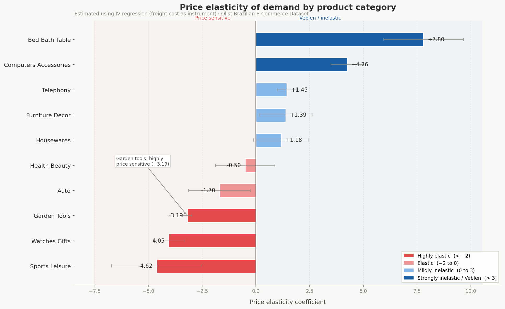
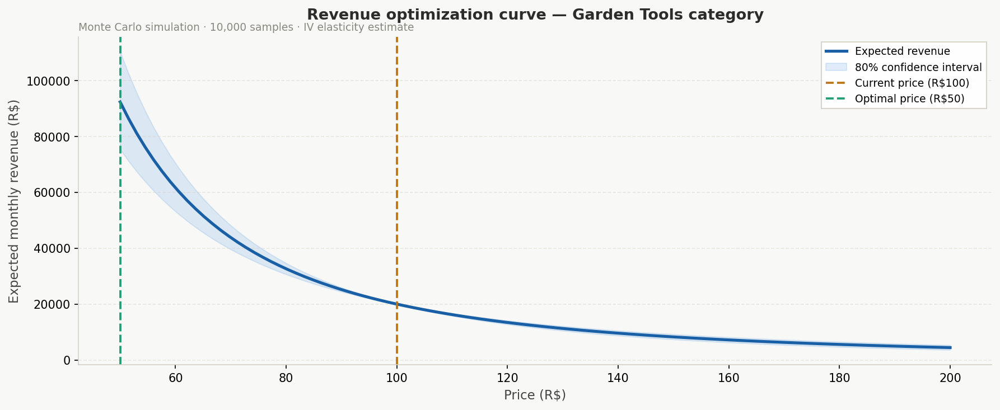
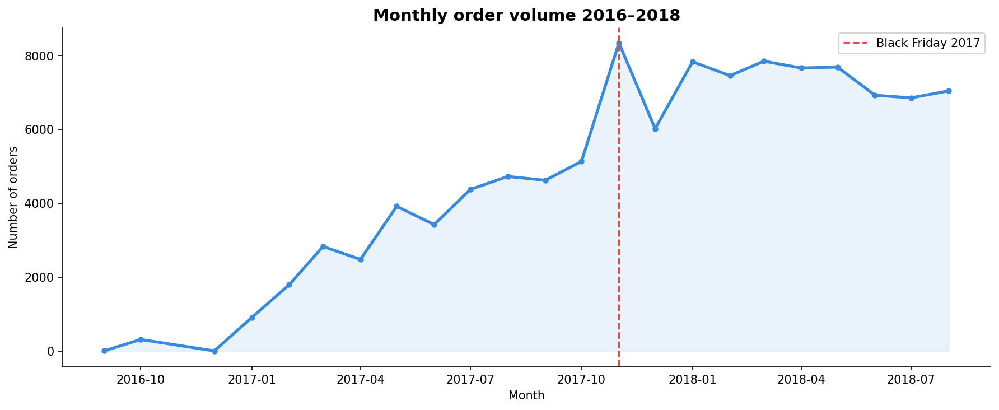

# Pricing Elasticity Engine

> Standard pricing models ignore endogeneity and produce biased elasticity estimates. This project uses instrumental variable (IV) regression and Monte Carlo simulation on 100k+ real transactions to build a pricing intelligence system that actually works.

## Key findings

- **Garden tools** showed elasticity of −3.19 — the most price-sensitive category. A 50% price reduction is estimated to generate a **362% revenue uplift** with 100% statistical confidence
- **OLS regression produced a biased elasticity of +0.009** (wrong sign) due to endogeneity. IV regression corrected this to economically meaningful estimates
- **Bed bath & table and computers accessories** exhibit Veblen good behavior — positive elasticity suggests higher prices signal quality and attract more buyers in these categories
- First-stage F-statistic of **1,287** confirms instrument strength (threshold: >10)

## The endogeneity problem

Sellers raise prices when demand is high. This means price and sales volume are positively correlated in raw data — not because high prices cause high sales, but because a third variable (demand shocks, seasonality) drives both. OLS mistakes this for causation and produces a biased elasticity estimate.

**Fix:** Instrumental variable regression (2SLS) using freight cost as an instrument. Freight costs affect price but have no direct effect on demand — isolating the causal price effect.

## Project architecture

```
Raw CSVs (9 files)
    ↓
SQLite Database (olist.db)
    ↓
Feature Engineering + EDA
    ↓
OLS Regression → Endogeneity detected
    ↓
IV Regression (2SLS) → Corrected elasticity
    ↓
Monte Carlo Price Optimizer
    ↓
Streamlit Dashboard (coming soon)
```

## Charts

### Price elasticity by category


### Revenue optimization curve — Garden Tools


### Monthly order volume 2016–2018


## Tech stack

| Layer | Tools |
|---|---|
| Language | Python 3.14 |
| Data manipulation | pandas, NumPy |
| Database | SQLite, SQLAlchemy |
| Econometrics | statsmodels, linearmodels |
| Simulation | scipy, NumPy Monte Carlo |
| Visualization | matplotlib, seaborn |
| Dashboard | Streamlit, Plotly (coming soon) |
| Version control | Git, GitHub |

## Dataset

[Brazilian E-Commerce Public Dataset by Olist](https://www.kaggle.com/datasets/olistbr/brazilian-ecommerce) — 100k+ orders across 9 relational tables, 2016–2018.

## Notebooks

| Notebook | Description |
|---|---|
| `01_load_data.ipynb` | Load 9 CSVs into SQLite database, SQL joins, data cleaning |
| `02_eda.ipynb` | Exploratory analysis — price distributions, seasonality, demand curves |
| `03_modeling.ipynb` | OLS vs IV regression, elasticity by category, Monte Carlo optimizer |

## Author

**Satyam Patel** — Business Analytics + Economics, Arizona State University
[LinkedIn](https://linkedin.com/in/patelsatyam18) · [GitHub](https://github.com/devsp18)